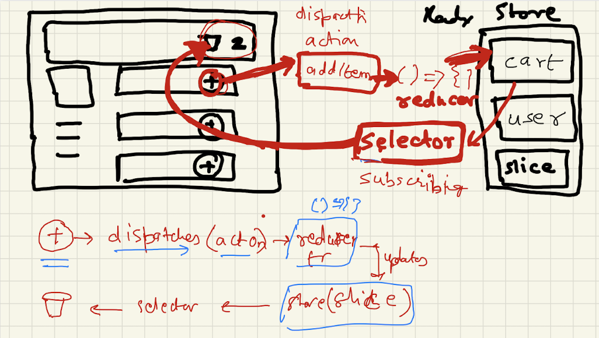

# 12 - Let's build our store

🚀 Today, we delved into the world of Redux, an external state management library. We explored the challenges of data management with other methods like Props drilling and Context API. This chapter focused on the significance of Redux, compared Redux Toolkit and React-Redux, and walked through configuring and implementing React Redux.

## Key Learnings:

- How Redux works, including Redux Toolkit Architecture (RTK).
- Creating a Redux store using `configureStore()`.
- Slicing and dicing the state with `createSlice()`.
- Providing the Redux store to the application via `<Provider store={}/>`.

## More Insights:

Chapter-12 Let's build our store
In this chapter, we delved into Redux, an efficient state management library for more complex applications. When a small app may suffice with Context API, Redux becomes indispensable as your app grows. We explored the challenges with Redux, its complex configuration, and the often daunting boilerplate code. To address these concerns, Redux Toolkit comes to the rescue.

Redux vs. Redux Toolkit:
Redux is like a central object accessible to all components, while state variables' scope remains within a single component. Redux Toolkit simplifies Redux's complexities by providing logical separation through different slices.

Today's Feature: Cart Workflow
We embarked on creating a cart workflow, where clicking the "Add" button adds items to the cart.

Steps:

Writing into the Store

When a modification in the store is needed, we dispatch an action that calls a reducer function, updating the slice.
Example: Click "Add" button -> addItem -> reducer -> cart in store.
Jargons: Dispatch, action, reducer, slice, store

Reading from the Store

To read from the store, we call a Selector Hook (function) that selects a slice of the store, updating the cart component.
The cart component is subscribed to the store using the Selector.
Jargons: Selector, slice, store

Toolkit: The Core of Redux
React-redux acts as a bridge between Redux and React.

Steps:

Create store.js file in utils and import configureStore() from RTK.
Create the store using configureStore() and export it.
Import { Provider } from react-redux in the root component.
Import the store from utils in the root component.
Enclose the components needing the store using <Provider>.
Pass store as a prop.
Create cartSlice.js in utils and import createSlice() from RTK.
Create a cartSlice using createSlice with name, initialState (items: []), and reducers function.
The reducers function contains dispatched actions, e.g., addItem with state and action parameters.
The state contains the slice's states and actions.
Modifications are made to the state inside the action of reducers: addItem, removeItem, clearCart.
Export the reducer cartSlice.reducer (default export).
Export cartSlice.actions with all the action functions (destructured named exports).
Import cartSlice into the store.
Understanding Background Storage of createSlice:
cartSlice is a structured object with actions and reducers.

useSelector: What it is subscribing to.

useContext vs Redux

| Context API                 | Redux                      |
| --------------------------- | -------------------------- |
| Built-in React tool         | Third-party library        |
| Minimal setup required      | Extensive setup needed     |
| Suitable for static data   | Useful for static and dynamic data |
| Limited debugging options  | Enhanced debugging with Redux Dev Tools |
| Great for small projects    | Ideal for larger projects   |

Advantages of Redux Toolkit over Redux

1. Abstraction and Convenience.
2. Immutable updates made easy.
3. Simplified Reducers with `createSlice`.
4. Improved Performance.
5. Better Debugging tools.

Dispatcher in Redux

- A dispatcher is a function that dispatches actions to the store, triggering state changes.
- You can create and use a dispatcher function using `useDispatch()`.

Reducer in Redux

- A reducer is a pure function that takes the current state and an action, returning a new state.
- Reducers update the state based on dispatched actions.

Understanding a Slice in Redux

In Redux Toolkit, a slice is a piece of the state managed by a set of actions and a reducer.

Selectors in Redux

- Selectors are pure functions that derive values from the state.
- `useSelector()` in `react-redux` subscribes to and tracks state changes using a selector function.

Explaining `createSlice` and its Configuration

- `createSlice` is used to create a store slice.
- Configuration includes `name`, `initialState`, and `reducers`.

Practice coding with Redux, create a store, slices, and perform read and write operations. Build a Cart Flow using Redux Store.

## Quick Code Reference

| Project             | Tech Stack | Source Code |
| -------------------  | ----------  | ---------- |
| Food Delivery App    | React      | [utils/store.js](./src/utils/store.js) [utils/cartSlice.js](./src/utils/cartSlice.js) [App.js](./src/App.js) [Header.js](./src/components/Header.js) [RestaurantMenu.js](./src/components/RestaurantMenu.js) [Cart.js](./src/components/Cart.js) |

## Quick Recap

Redux empowers us to dispatch actions, call reducers, and update the store slice seamlessly. Subscribing to the store automagically reflects state changes.

